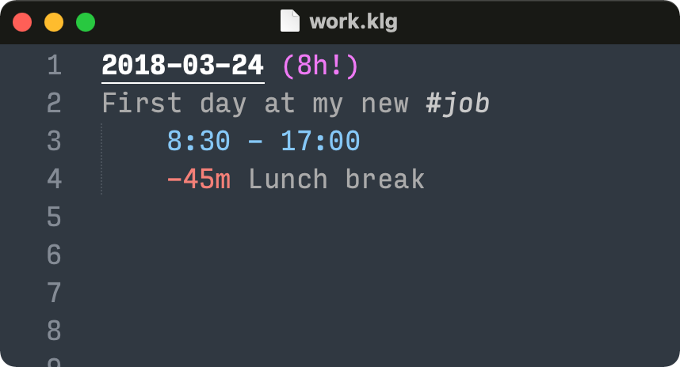

# klog for Sublime Text

This packages provides support for working with [klog time tracking](https://klog.jotaen.net) files in the Sublime Text editor:

- Syntax highlighting
	+ If you use the Mariana or Monokai theme, it also assigns meaningful colouring.
- Smart completion for inserting the current date or time. For example:
	+ Typing `today` completes to the current date
	+ Typing `now` completes to the current time
- A few sensible default settings for the `.klg` file format

